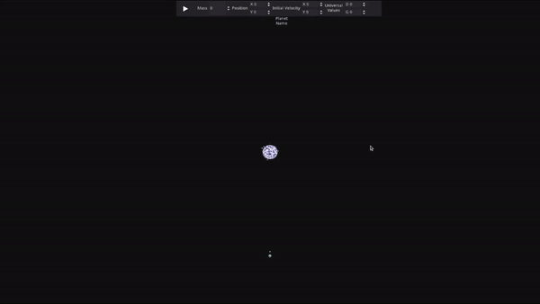

# Solar System Simulator 

## Features
In this Solar System Simulation, you can:
  - Move planets with a mouse
  - Control velocity
  - Change mass
  - Give position
  - Visualize planet trajectory path
  - Manipulate G and distance multiplier constants
  - Capable to handle planets as much as you want (Currently planets can be added only in the editor)

## About
  Simulation's key formula is Newton's law of Universal Gravitation. This simulation not references real-life solar system, but can be used for educational purposes. 

 Until June, I am planning to add features like:
  - Adding/deleting planets
  - Multi-selection
  - Save and load scenes from json

## Controls
- You can select a planet by left clicking
- Move planet by clicking then holding left click 
- Move around by holding right click
- Scroll for zoom
- You modify the selected planet by UI on top of the screen.  
  
## Installation

- __Release Packages:__ 
  You can directly install build files. They are available [here](https://github.com/KozhaAkhmet/solar-system-in-godot/releases/tag/0.1) for Windows and Linux.

- __Source Code:__
  Also you can clone source code and export it to desired OS. You can check up on exporting in [Godot DOCS](https://docs.godotengine.org/en/stable/tutorials/export/exporting_projects.html)

## References:
- This simulation is based on [Sebastian Lague's Solar System in Unity](https://github.com/SebLague/Solar-System/tree/Episode_01)
  
- [Planet Generator For Animation Sprites](https://deep-fold.itch.io/pixel-planet-generator)
- [Icon Pack](https://gamedeveloperstudio.itch.io/icon-pack)